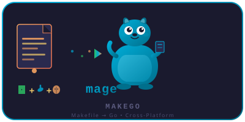

# mage-makefile / Makefile → magefile 转换工具

> **Convert GNU Makefiles to Go magefiles with cross-platform compatibility checks.**
> **将 GNU Makefile 转换为 Go magefile，并附带跨平台兼容性检查。**

[](https://go.dev)
[](LICENSE)

<p align="center">
  
</p>
<p style="text-align:center; color: #8a8aab; font-size: 14px;">
  <em>🐭 可爱的 Golang 鼹鼠吉祥物 — Makefile 转换为 Go 的魔法助手</em>
</p>

---

## Features / 功能特性

| EN | CN |
|----|----|
| **Makefile Parser** — Full GNU Makefile syntax support (targets, variables, conditionals, includes, define/endef) | **Makefile 解析器** — 完整支持 GNU Makefile 语法（目标、变量、条件语句、包含、多行定义） |
| **Go magefile Generator** — Converts Makefile targets to Go functions with os/exec calls | **Go magefile 生成器** — 将 Makefile 目标转换为 Go 函数，使用 os/exec 调用 |
| **Cross-Platform Detection** — Scans Makefile commands and checks compatibility on Linux/macOS/Windows | **跨平台检测** — 扫描 Makefile 命令并检查在 Linux/macOS/Windows 上的兼容性 |
| **Interactive Conversion** — TUI workflow to select targets, preview code, accept/reject | **交互式转换** — 终端交互流程，选择目标、预览代码、接受/拒绝 |
| **Config-Driven** — `.mage_makefile.toml` for target filtering, command mapping, output customization | **配置驱动** — 通过 `.mage_makefile.toml` 配置目标过滤、命令映射、输出定制 |
| **Script Engine** — Lua/JavaScript/Go engines for custom bash function transformation | **脚本引擎** — Lua/JavaScript/Go 引擎用于自定义 bash 函数转换 |
| **Command Installer** — Interactive installation guidance for missing cross-platform commands | **命令安装器** — 为缺失的跨平台命令提供交互式安装引导 |
| **Self-Hosting** — Project uses mage for its own build process (cross-platform, zero shell dependency) | **自托管** — 项目自身使用 mage 构建，跨平台零 Shell 依赖 |

---

## Installation / 安装

### Option 1: Pre-built binary / 方式一：预编译二进制

Download the latest release from [Releases](https://github.com/VDHewei/mage-makefile/releases) page.

从 [Releases](https://github.com/VDHewei/mage-makefile/releases) 页面下载最新版本。

### Option 2: Build from source / 方式二：源码构建

```bash
git clone https://github.com/VDHewei/mage-makefile.git
cd mage-makefile

# Build with mage (cross-platform, recommended) / 使用 mage 构建（跨平台，推荐）
go install github.com/magefile/mage@latest
mage install

# Or build directly with go / 或直接使用 go 构建
go install ./cmd/makego/
```

### Option 3: Go install / 方式三：Go 安装

```bash
go install github.com/VDHewei/mage-makefile/cmd/makego@latest
```

---

## Quick Start / 快速上手

```bash
# Convert a Makefile to magefile.go / 将 Makefile 转换为 magefile.go
makego convert Makefile

# Check cross-platform compatibility / 检查跨平台兼容性
makego detect Makefile

# Interactive conversion with target selection / 交互式转换（选择目标）
makego convert Makefile --interactive

# Show help / 查看帮助
makego --help
```

---

## Usage / 使用方法

### Convert / 转换

```bash
# Basic conversion / 基本转换
makego convert Makefile

# Specify output file / 指定输出文件
makego convert Makefile -o magefile.go

# Target platform for shell command conversion / 指定目标平台进行命令转换
makego convert Makefile --platform windows

# Interactive mode: select targets, preview code / 交互模式：选择目标，预览代码
makego convert Makefile --interactive

# List targets without converting / 仅列出目标，不进行转换
makego convert Makefile --list-targets

# Use Lua/JS script engine for bash functions / 使用 Lua/JS 脚本引擎处理 bash 函数
makego convert Makefile --script lua
makego convert Makefile --script js
```

### Detect / 检测

```bash
# Basic compatibility check / 基础兼容性检查
makego detect Makefile

# Check for a specific target OS / 检查特定目标操作系统
makego detect Makefile --os linux
makego detect Makefile --os windows

# Detailed report / 详细报告
makego detect Makefile --report

# JSON output for CI integration / JSON 格式输出（适用于 CI 集成）
makego detect Makefile --json

# Interactive installation for missing commands / 交互式安装缺失命令
makego detect Makefile --interactive

# Auto-install missing commands / 自动安装缺失命令
makego detect Makefile --install

# Check a single command / 检查单个命令
makego detect go
makego detect gcc
```

### Compile / 编译

```bash
# Compile magefile.go to native binary / 编译 magefile.go 为本地二进制
makego compile magefile.go

# Cross-compile for another platform / 交叉编译到其他平台
makego compile magefile.go --os linux --arch amd64
```

### Version / 版本

```bash
makego version
```

---

## Configuration / 配置

Create a `.mage_makefile.toml` file in your project root:

在项目根目录创建 `.mage_makefile.toml` 文件：

```toml
[convert]
# Target filtering: include only these targets / 目标过滤：仅包含这些目标
include_targets = ["build", "test", "clean"]

# Exclude specific targets / 排除特定目标
exclude_targets = [".PHONY", "help"]

# Output style: standard, verbose, minimal / 输出样式
output_style = "standard"

# Add Makefile source as comments / 添加 Makefile 源码作为注释
add_comments = true

# Include original shell commands as comments / 包含原始 shell 命令作为注释
add_original = false

# Default target platform / 默认目标平台
default_platform = ""

[hub]
server_url = "https://magego.hub.io"
timeout = "30s"
```

---

## Development / 开发

### Prerequisites / 前置条件

- Go 1.25+
- Mage (optional, for magefile targets / 用于 magefile 目标): `go install github.com/magefile/mage@latest`

### Available Mage Targets / 可用的 Mage 目标

| Target | Description (EN) | Description (CN) |
|--------|-----------------|------------------|
| `build` | Compile makego CLI binary | 编译 makego CLI 二进制文件 |
| `install` | Install to GOPATH/bin | 安装到 GOPATH/bin |
| `test` | Run all unit tests (verbose) | 运行所有单元测试（详细） |
| `testShort` | Run tests (compact) | 运行测试（简洁） |
| `testRace` | Run tests with race detector | 使用竞态检测器运行测试 |
| `vet` | Run go vet | 运行 go vet |
| `lint` | Run golangci-lint | 运行 golangci-lint |
| `format` | Check gofmt formatting | 检查 gofmt 格式 |
| `clean` | Remove build artifacts | 清理构建产物 |
| `coverage` | Run tests with coverage report | 运行测试并生成覆盖率报告 |
| `check` | Full quality gate (vet + format + build + test) | 完整质量门禁 |
| `buildAll` | Cross-compile for all platforms | 为所有平台交叉编译 |
| `all` | Default: build → vet → test | 默认：构建 → 检查 → 测试 |

```bash
# Build the project / 构建项目
mage build

# Run tests / 运行测试
mage test

# Full quality check / 完整质量检查
mage check

# Cross-compile for all platforms / 全平台交叉编译
mage buildAll
```

### Project Structure / 项目结构

```
mage-makefile/
├── assets/logo.svg          # Project logo / 项目 Logo
├── cmd/makego/main.go       # CLI entry point / CLI 入口
├── internal/config/         # Default configurations / 默认配置
├── pkg/
│   ├── compiler/            # Go SDK download & cross-compile / Go SDK 下载与交叉编译
│   ├── config/              # Configuration system / 配置系统
│   ├── converter/
│   │   ├── generator/       # Go code generation / Go 代码生成
│   │   ├── interactive/     # TUI interactive workflow / 终端交互工作流
│   │   ├── parser/          # Makefile lexer & parser / Makefile 词法语法解析器
│   │   └── transformer/     # IR transformation / 中间表示转换
│   ├── runtime/             # Platform detection & compatibility / 平台检测与兼容性
│   └── script/              # Lua/JS/Go script engines / 脚本引擎
├── plans/                   # Development plans / 开发计划
├── testdata/                # Test Makefiles / 测试用 Makefile
└── magefile.go              # ⬅ Self-hosted build system / 自托管构建系统
```

---

## Cross-Platform Strategy / 跨平台策略

This project is **designed and tested on Windows** as the primary development platform, with full support for Linux and macOS.

本项目**以 Windows 为主要开发平台设计和测试**，同时完整支持 Linux 和 macOS。

| Concern / 关注点 | Approach / 方案 |
|------------------|----------------|
| Build System / 构建系统 | **mage** — Go-based, cross-platform, no shell/Makefile dependency |
| Shell Commands / Shell 命令 | Go `os/exec` — native cross-platform process execution |
| Path Handling / 路径处理 | `filepath.Join` + forward-slash normalization |
| Platform Detection / 平台检测 | `runtime.GOOS` + `exec.LookPath` for command discovery |
| Windows Compatibility / Windows 兼容 | Command mapping: `findstr` ≈ `grep`, `copy` ≈ `cp`, `dir` ≈ `ls` |
| Installation / 安装引导 | Interactive installer: URL / sh / bat / PowerShell / Go |

---

## Architecture / 架构

```
Makefile (input)
    │
    ▼
┌─────────────┐     ┌──────────────┐
│   Parser    │────▶│     AST      │
│  (lexer.go) │     │  (ast.go)    │
└─────────────┘     └──────┬───────┘
                           │
                           ▼
                    ┌──────────────┐     ┌──────────────┐
                    │ Transformer  │────▶│      IR      │
                    │ (platform.go)│     │              │
                    └──────────────┘     └──────┬───────┘
                                                │
                           ┌────────────────────┤
                           │                    │
                           ▼                    ▼
                    ┌──────────────┐    ┌──────────────┐
                    │  Generator   │    │  Interactive │
                    │ (template.go)│    │   (TUI)      │
                    └──────┬───────┘    └──────────────┘
                           │
                           ▼
                    magefile.go (output)
                           │
                           ▼
                    ┌──────────────┐
                    │   Compiler   │──▶ Native binary
                    │ (cross-comp) │
                    └──────────────┘
```

---

## License / 许可

MIT License. See [LICENSE](LICENSE).

---

## Project Status / 项目状态

| Phase / 阶段 | Description / 描述 | Status / 状态 |
|-------------|-------------------|------------|
| Phase 1 | Project Setup & Config / 项目初始化与配置 | Completed / 已完成 |
| Phase 2 | Makefile Parser / Makefile 解析器 | Completed / 已完成 |
| Phase 3 | CLI Integration / CLI 集成 | Completed / 已完成 |
| Phase 4 | Compatibility Detection / 兼容性检测 | Completed / 已完成 |
| Phase 5 | Interactive Conversion / 交互式转换 | Completed / 已完成 |
| Phase 6 | Cross-Compilation / 交叉编译 | Completed / 已完成 |
| Phase 7 | API Service (Hub) / API 服务 | Completed / 已完成 |
| Phase 8 | Hub Integration / Hub 集成 | Completed / 已完成 |

---

## Phase 8 Completion Summary / Phase 8 完成总结

Phase 8 (Hub Integration) has been successfully completed with the following features:

### Implemented Features / 已实现的功能

1. **Hub API Service (Phase 7)** - REST API for snippets
   - `Push` - Upload magefile snippets
   - `Pull` - Download snippets by name/version
   - `Search` - Search snippets by query/tags
   - `List` - List all snippets with pagination
   - `Version` - Get version history
   - `Login` - Authentication with username/password or API key

2. **Hub Web Frontend (Phase 8)** - Fiber-based HTTP server
   - Embedded static HTML/CSS/JS files
   - Snippet browser with search functionality
   - Upload form with metadata parsing
   - Snippet detail pages with code preview
   - About page
   - Login page and authentication handling

3. **CLI Integration**
   - `makego hub push/pull/search/list/versions/login`
   - `makego serve` - Built-in development server

4. **File-based Snippet Storage** - For local development/testing
   - In-memory storage with metadata extraction
   - Automatic parsing of `// @hub` metadata comments

### Files Created / 创建的文件

- `pkg/hub/web/embed.go` - Embedded static files
- `pkg/hub/web/server.go` - Fiber HTTP server with handlers
- `pkg/hub/web/metadata.go` - Metadata parsing utilities
- `pkg/hub/web/static/index.html` - Embedded HTML UI
- `testdata/Makefile` - Test Makefile for conversion

### Testing / 测试

All unit tests pass:
```
$ go test ./pkg/hub/...
PASS
ok      github.com/VDHewei/mage-makefile/pkg/hub      0.043s
```

The Hub web server is ready for local development with `makego serve` command.
